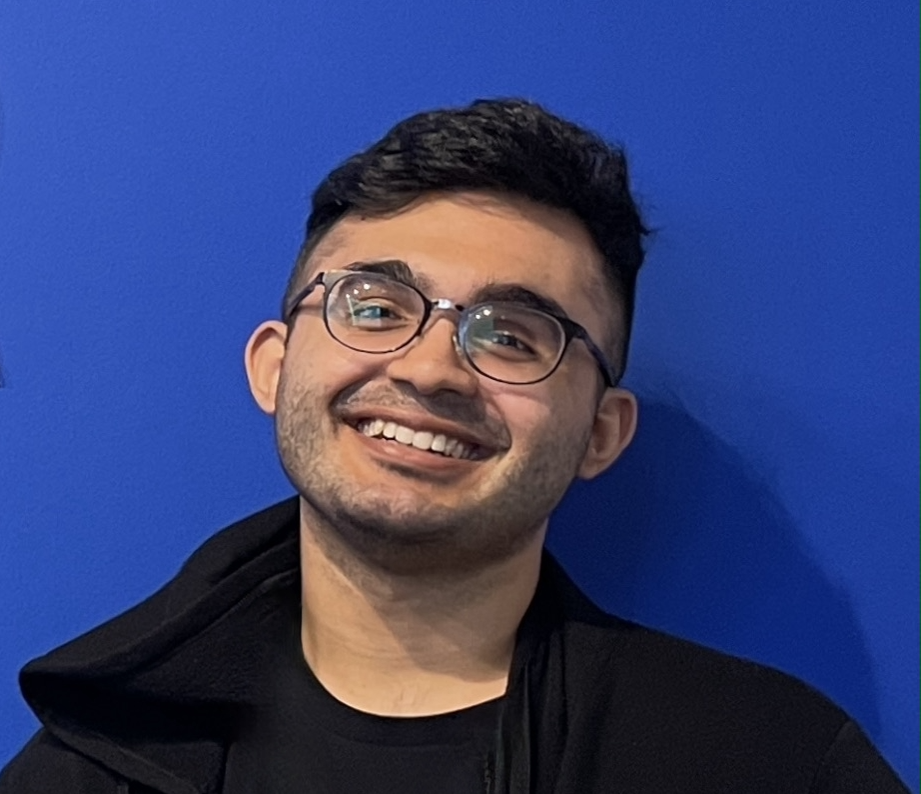
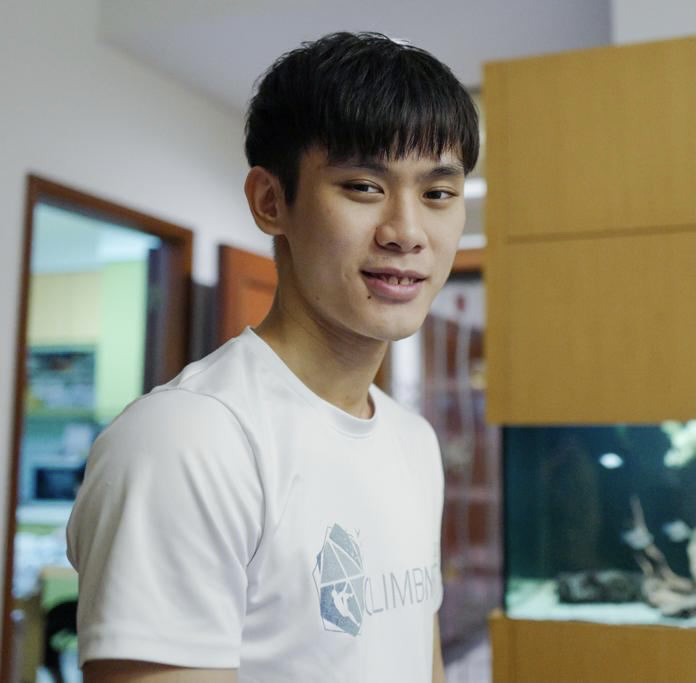

We are the team behind FriendBook.

## Project team

### Pawandeep Singh Sekhon

Pawandeep's [github](http://github.com/pss-coder)

Pawandeep's project [portfolio](team/pss-coder.md)

* Role: Team Lead
* Responsibilities: In charge of Deliverables and Deadlines, and UI

### Chin Ze-Xi, Sean

Sean's [github](http://github.com/xnajasho)

Sean's project [portfolio](team/xnajasho.md)

* Role: Developer
* Responsibilities: In charge of Scheduling and tracking, and Model

### Ronald Tan Sing Wei

Ronald's [github](http://github.com/ronaldtansingwei)

Ronald's project [portfolio](team/ronaldtansingwei.md)

* Role: Developer
* Responsibilities: In charge of Documentation, Testing, and Strategy

### Sajal Vaishnav

Sajal's [github](http://github.com/sajalvaishnav)

Sajal's project [portfolio](team/sajalvaishnav.md)

* Role: Developer
* Responsibilities: In charge of Integration, Code Quality, and Storage
