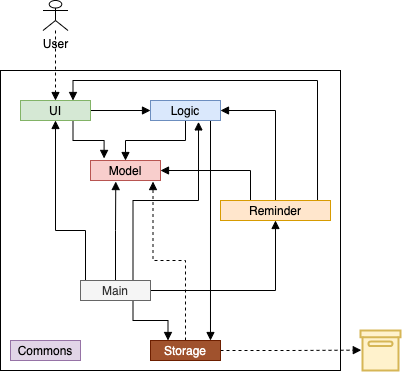
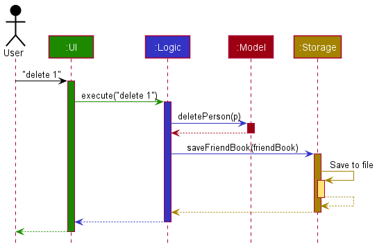
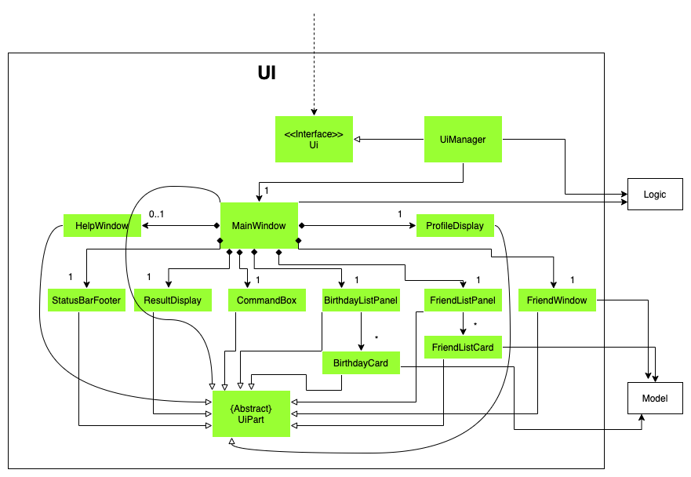
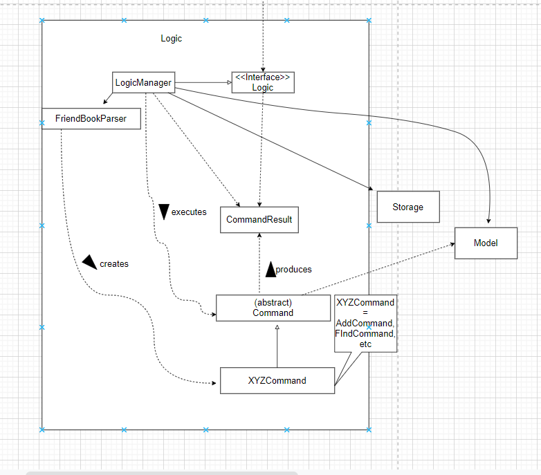
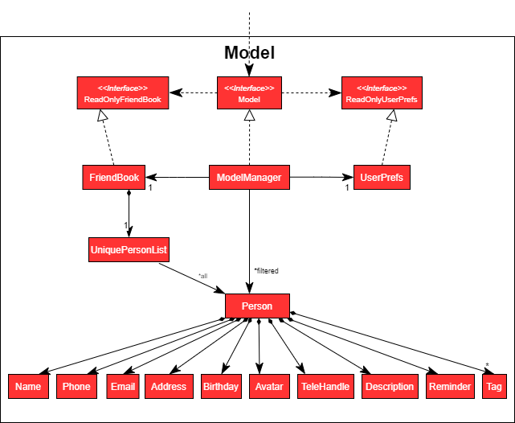
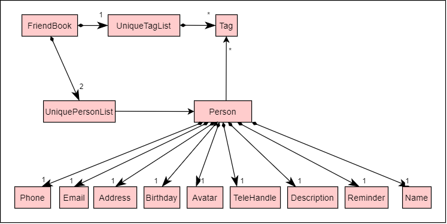
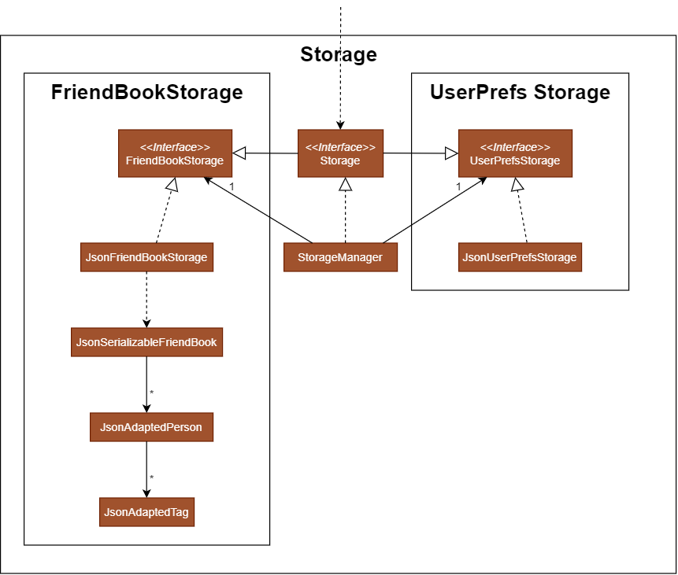
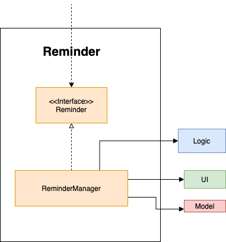
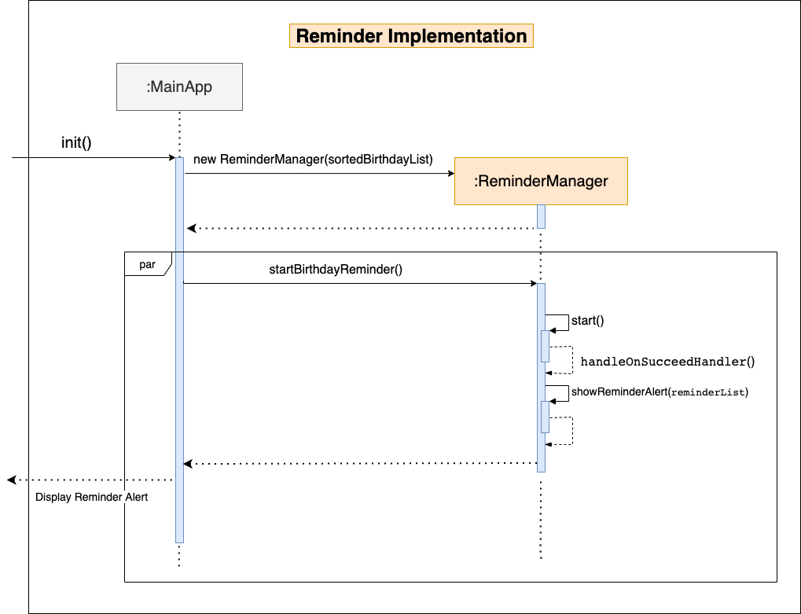
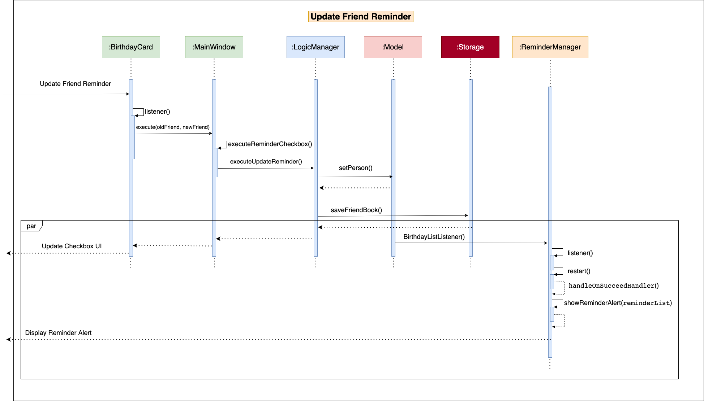

* Table of Contents
{:toc}

--------------------------------------------------------------------------------------------------------------------

## **Acknowledgements**

This project is based on the AddressBook-Level3 project created by the [SE-EDU initiative](https://se-education.org).

--------------------------------------------------------------------------------------------------------------------

## **Setting up, getting started**

Refer to the guide [_Setting up and getting started_](SettingUp.md).

--------------------------------------------------------------------------------------------------------------------

## **Design**

:bulb: **Tip:** The diagrams shown below were made from [diagrams.net](https://www.diagrams.net/) and PlantUML.

### Architecture

The ***Architecture Diagram*** given above explains the high-level design of the App.

Given below is a quick overview of main components and how they interact with each other.

**Main components of the architecture**

**`Main`** has two classes called [`Main`](https://github.com/AY2122S1-CS2103-F10-3/tp/blob/master/src/main/java/seedu/friendbook/Main.java) and [`MainApp`](https://github.com/AY2122S1-CS2103-F10-3/tp/blob/master/src/main/java/seedu/friendbook/MainApp.java). It is responsible for,
* At app launch: Initializes the components in the correct sequence, and connects them up with each other.
* At shut down: Shuts down the components and invokes cleanup methods where necessary.

[**`Commons`**](#common-classes) represents a collection of classes used by multiple other components.

The rest of the App consists of four components.

* [**`UI`**](#ui-component): The UI of the App.
* [**`Logic`**](#logic-component): The command executor.
* [**`Model`**](#model-component): Holds the data of the App in memory.
* [**`Storage`**](#storage-component): Reads data from, and writes data to, the hard disk.
* [**`Reminder`**](#reminder-component): Runs on a background thread in checking upcoming birthdays and displaying reminder alerts.

**How the architecture components interact with each other**

The *Sequence Diagram* below shows how the components interact with each other for the scenario where the user issues the command `delete 1`.

Each of the four main components (also shown in the diagram above),

* defines its *API* in an `interface` with the same name as the Component.
* implements its functionality using a concrete `{Component Name}Manager` class (which follows the corresponding API `interface` mentioned in the previous point.

For example, the `Logic` component defines its API in the `Logic.java` interface and implements its functionality using the `LogicManager.java` class which follows the `Logic` interface. Other components interact with a given component through its interface rather than the concrete class (reason: to prevent outside component's being coupled to the implementation of a component), as illustrated in the (partial) class diagram below.

The sections below give more details of each component.

### UI component

The **API** of this component is specified in [`Ui.java`](https://github.com/AY2122S1-CS2103-F10-3/tp/blob/master/src/main/java/seedu/friendbook/ui/Ui.java)

The UI consists of a `MainWindow` that is made up of parts e.g.`BirthdayListPanel`, `FriendListPanel`, `ProfileDisplay`, `FriendWindow` etc. All these, including the `MainWindow`, inherit from the abstract `UiPart` class which captures the commonalities between classes that represent parts of the visible GUI.

The `UI` component uses the JavaFx UI framework. The layout of these UI parts are defined in matching `.fxml` files that are in the `src/main/resources/view` folder. For example, the layout of the [`MainWindow`](https://github.com/AY2122S1-CS2103-F10-3/tp/blob/master/src/main/java/seedu/friendbook/ui/MainWindow.java) is specified in [`MainWindow.fxml`](https://github.com/AY2122S1-CS2103-F10-3/tp/blob/master/src/main/resources/view/MainWindow.fxml)

The `UI` component,

* executes user commands using the `Logic` component.
* listens for changes to `Model` data so that the UI can be updated with the modified data.
* keeps a reference to the `Logic` component, because the `UI` relies on the `Logic` to execute commands as well as listen to the `Reminder` component.
* depends on some classes in the `Model` component, as it displays `Person` object residing in the `Model`.
* depends on a functional interface in the `Reminder` component, because the `UI` updates the `Reminder` component on reminder changes. 

### Logic component

**API** : [`Logic.java`](https://github.com/AY2122S1-CS2103-F10-3/tp/blob/master/src/main/java/seedu/friendbook/logic/Logic.java)

Here's a (partial) class diagram of the `Logic` component:

How the `Logic` component works:
1. When `Logic` is called upon to execute a command, it uses the `FriendBookParser` class to parse the user command.
1. This results in a `Command` object (more precisely, an object of one of its subclasses e.g., `AddCommand`) which is executed by the `LogicManager`.
1. The command can communicate with the `Model` when it is executed (e.g. to add a person).
1. The result of the command execution is encapsulated as a `CommandResult` object which is returned back from `Logic`.

The Sequence Diagram (simplified) below illustrates the interactions within the `Logic` component for the `execute("delete 1")` API call.

Here are the other classes in `Logic` (omitted from the class diagram above) that are used for parsing a user command:

How the parsing works:
* When called upon to parse a user command, the `FriendBookParser` class creates an `XYZCommandParser` (`XYZ` is a placeholder for the specific command name e.g., `AddCommandParser`) which uses the other classes shown above to parse the user command and create a `XYZCommand` object (e.g., `AddCommand`) which the `FriendBookParser` returns back as a `Command` object.
* All `XYZCommandParser` classes (e.g., `AddCommandParser`, `DeleteCommandParser`, ...) inherit from the `Parser` interface so that they can be treated similarly where possible e.g, during testing.

### Model component
**API** : [`Model.java`](https://github.com/AY2122S1-CS2103-F10-3/tp/blob/master/src/main/java/seedu/friendbook/model/Model.java)

The `Model` component,

* stores the friend book data i.e., all `Person` objects (which are contained in a `UniquePersonList` object).
	* 2 copies of the `UniquePersonList` containing the exact same `Person` objects are used. The only difference is the ordering of the `Person` objects in each of the lists, where one list functions as a contact list and the other functions as a birthday list which is sorted based on earliest birthday.
* stores the currently 'selected' `Person` objects (e.g., results of a search query) as a separate _filtered_ list which is exposed to outsiders as an unmodifiable `ObservableList<Person>` that can be 'observed' e.g. the UI can be bound to this list so that the UI automatically updates when the data in the list change.
* stores a `UserPref` object that represents the user’s preferences, which includes the border sizes of the app and the profile name. This is exposed to the outside as a `ReadOnlyUserPref` objects.
* stores a `Reminder` object which is associated to a `Person` object. Note that this `Reminder` is functionally different from the `Reminder` component. The `Reminder` object in the `Model` component is simply a class to store the details of a `Reminder` and to ascertain if a `Person` has his/her `Reminder` enabled.
* does not depend on any of the other three components (as the `Model` represents data entities of the domain, they should make sense on their own without depending on other components)

:information_source: **Note:** An alternative (arguably, a more OOP) model is given below. It has a `Tag` list in the `FriendBook`, which `Person` references. This allows `FriendBook` to only require one `Tag` object per unique tag, instead of each `Person` needing their own `Tag` objects. 

### Storage component

**API** : [`Storage.java`](https://github.com/AY2122S1-CS2103-F10-3/tp/blob/master/src/main/java/seedu/friendbook/storage/Storage.java)

The `Storage` component,
* can save both friend book data and user preference data in json format, and read them back into corresponding objects.
* inherits from both `FriendBookStorage` and `UserPrefStorage`, which means it can be treated as either one (if only the functionality of only one is needed).
* depends on some classes in the `Model` component (because the `Storage` component's job is to save/retrieve objects that belong to the `Model`)

### Reminder component
**API** : [`Reminder.java`](https://github.com/AY2122S1-CS2103-F10-3/tp/blob/master/src/main/java/seedu/friendbook/reminder/Reminder.java)

How the `Reminder` component works,
* Runs every 12 hour starting with a 10second delay on application opening in the background.
* Under `ReminderManager` class, it will check birthdays that upcoming in a week or less.
* Displays an alert for the upcoming birthdays to notify user.
* Relies on some methods in the `Logic` component (because the `UI` component's job is to allow user to enable/disable reminders.)
* depends on the `Person` class in order to display relevant information in the alert.

### Common classes

Classes used by multiple components are in the `seedu.friendbook.commons` package.

--------------------------------------------------------------------------------------------------------------------

## **Implementation**

This section describes some noteworthy details on how certain features are implemented.

### Reminder Feature

#### Implementation

Below is a sequence diagram of how the Reminder feature is initialised.

The reminder mechanism is facilitated by the [`ReminderManager.java`](https://github.com/AY2122S1-CS2103-F10-3/tp/blob/master/src/main/java/seedu/friendbook/reminder/ReminderManager.java) class.
It extends to an internal JavaFX java library [`ScheduledService`](https://docs.oracle.com/javase/8/javafx/api/javafx/concurrent/ScheduledService.html),
which executes tasks in the background without affecting UI thread.

The `ReminderManager` class executes a task which checks for upcoming birthdays that are coming in a week or less
and user wishes to have these friends' birthday to be reminded.

The implementation relies on the `Model` for its birthday list. For every change in the birthday list,
results in the `ReminderManger` class restarting the task to get the latest version of the birthday list. It does so by adding a
listener to the birthday list.

The way the list is updated relies on the `Logic` component and `UI` component.
In the `BirthdayCard`class and `MainWindow` class under `UI` component, which makes use of an functional
interface [`SetRemindExecutor`](https://github.com/AY2122S1-CS2103-F10-3/tp/blob/20bd196ca06820b425556ab4dc57dfcd5924a563/src/main/java/seedu/friendbook/reminder/ReminderManager.java#L122)
in `ReminderManager` class for every update in the reminder checkbox in `BirthdayCard.java`.

For every change in the reminder checkbox in `BirthdayCard` class, [`LogicManager#executeUpdateReminder(Person, Person)`](https://github.com/AY2122S1-CS2103-F10-3/tp/blob/20bd196ca06820b425556ab4dc57dfcd5924a563/src/main/java/seedu/friendbook/logic/LogicManager.java#L62) method
updates the birthday list which then results in the listener in the `ReminderManager` class to restart the background task.

If there exists a birthday that is less than a week or less, and user wishes for that birthday to be reminded, a popup alert will display
a message of all friends that have birthdays coming in a week or less.

Below is another sequence diagram showing a scenario of when a reminder checkbox is updated by the user:

--------------------------------------------------------------------------------------------------------------------

## **Documentation, logging, testing, configuration, dev-ops**

* [Documentation guide](Documentation.md)
* [Testing guide](Testing.md)
* [Logging guide](Logging.md)
* [Configuration guide](Configuration.md)
* [DevOps guide](DevOps.md)

--------------------------------------------------------------------------------------------------------------------

## **Appendix: Requirements**

### Product scope

**Target user profile**:

* has a need to manage a significant number of contacts
* prefer desktop apps over other types
* can type fast
* prefers typing to mouse interactions
* is reasonably comfortable using CLI apps

**Value proposition**: manage contacts faster than a typical mouse/GUI driven app

### User stories

Priorities: High (must have) - `* * *`, Medium (nice to have) - `* *`, Low (unlikely to have) - `*`

| Priority | As a …​                                    | I want to …​                     | So that I can…​                                                        |
| -------- | ------------------------------------------ | ------------------------------ | ---------------------------------------------------------------------- |
| `* * *`  | user                                       |view all my friends             | look at the friends i have         |
| `* * *`  | user                                       | add a new person               | keep in contact with the friend                                       |
| `* * *`  | user                                       | edit my friend's details              | update my friend's details                                  |
| `*`      | user                                       | delete a friend       | remove him from my contacts |
| `* *`    | user                                       | find friends by tags     | find my friends belonging to certain groups                        |
| `* *`    | user                                       | find friends by name     | filter friends and find friends |
| `* * *`  | user                                       | view my friends' details       | retrieve my friend's details whenever I need them                      |
| `* * *`  | user                                       | view friends by their birthdays| glance at which friends have their birthdays coming up|
| `* *`    | user                                       | view my friend's age           | know how old my friend is|
| `* * *`  | forgetful user                             | be reminded of my friends' birthdays| keep track of my friends' birthdays and if they are nearing       |  
| `* *`    | user                                       | add my friend's Telegram ID| contact my friend on telegram    |
| `* `     | user                                       | add custom avatars to my friends       | to keep track of my friends' ages                                      |
| `*`      | user                                       | add my own username to my profile             | personalise my FriendBook experience|
| `*`      | forgetful user                             | refer to the usage instructions |familiarise myself with FriendBook usage |

### Use cases

(For all use cases below, the **System** is the `FriendBook` and the **Actor** is the `user`, unless specified otherwise)

#### Friend Contacts Use Cases

**Use Case 1 (UC1): View all friends**

**MSS**
1. User requests to list all friends.
2. FriendBook shows the list of friends stored within.

    Use case ends.

Extensions

* 2a. The list is empty.

    Use case ends.

**Use case 2 (UC2): Add a friend**

**MSS**

1.  User requests to list friends.
2.  FriendBook shows a list of friends.
3.  User requests to add a friend with the given information.
4.  FriendBook adds the friend and updates the list

    Use case ends.

**Extensions**

* 3a. The given information is invalid as it does not follow the correct syntax.

    * 3a1. FriendBook shows an error message.

      Use case resumes at step 2.

* 3b. The user input is already in the list.

    * 3b1. FriendBook informs user that their input is already stored in the list.

      Use case resumes at step 2.

**Use case 3 (UC3): Edit friend details**

**MSS**

1. User requests to list friends.
2. FriendBook shows the list of friends.
3. User requests to edit the information of a specific friend in the list.
4. FriendBook updates the information of the specific friend and displays the new information.

    Use case ends.

**Extensions**

* 2a. The list is empty.

  Use case ends.

* 3a. The given index is invalid.

	* 3a1. FriendBook shows an error message.

	  Use case resumes at step 2.

* 3b. The information to be updated is invalid.

	* 3b1. FriendBook shows an error message.

	  Use case resumes at step 2.

**Use case 4 (UC4): Delete a friend**

**MSS**

1. User requests to list friends.
2. FriendBook shows the list of friends.
3. User requests to delete a specific friend in the list.
4. FriendBook deletes the friend and updates the list.

   Use case ends.

**Extensions:**

* 2a: List is empty.

  Use case ends.

* 3a. The given index is invalid.

	* 3a1. FriendBook shows an error message.
 
	  Use case resumes at step 2.

**Use case 5 (UC5): Find friends by tag**

**MSS:**

1. User specifies a set of keywords.
2. FriendBook displays a list of person(s) with tags matching the keyword(s).

   Use case ends.

**Extensions:**

* 2a: List is empty.

  Use case ends.

* 2b: Keywords do not match any of the tags that any of the friends have.
  
    * 2b1: FriendBook displays an empty list.
      
      Use case ends.

**Use case 6 (UC6): Find friends by name**

**MSS:**

1. User specifies a set of keywords.
2. FriendBook displays a list of person(s) with names matching the keyword(s).
  
    Use case ends.

**Extensions:**

* 2a: List is empty.

  Use case ends.

* 2b: Keywords do not match any of the names that any of the friends have.

    * 2b1: FriendBook displays an empty list.
      
      Use case ends.

**Use case 7 (UC7): View friend details**

**MSS:**

1. User requests to list friends.
2. FriendBook shows the list of friends.
3. User requests to view the complete details of a specified friend in the list.
4. FriendBook displays the full contact details of the specified person.

   Use case ends.

**Extensions:**

* 2a: List is empty.

  Use case ends.

* 3a. The given index is invalid.

    * 3a1. FriendBook shows an error message.
      
      Use case resumes at step 2.

#### Birthday Use Cases

**Use case 8 (UC8): View friends by birthday**

**MSS:**

1. User requests to list friends.
2. FriendBook shows the list of friends.
3. User requests to view the birthday of a specified person in the list.
4. FriendBook displays the birthday of the specified person. 
   
    Use case ends.

**Extensions:**

* 2a: List is empty.
  
  Use case ends.
  
* 3a. The given index is invalid.
  
  * 3a1. FriendBook shows an error message.
    
    Use case resumes at step 2.

**Use case 9 (UC9): View friend's age**

**MSS:**

1. User requests to list friends.
2. FriendBook shows the list of friends.
3. User requests to view the age of a specified person in the list.
4. FriendBook displays the age of the specified person.

    Use case ends.

**Extensions:**

* 2a: List is empty.

  Use case ends.

* 3a: The given index is invalid.

    * 3a1: FriendBook shows an error message.

      Use case ends.

#### Reminder Use Cases

**Use case 10 (UC10): Set birthday reminder for a friend**

**MSS:**

1. User requests to list friends.
2. FriendBook shows the list of friends.
3. User sets the birthday reminder of a selected friend to on.
4. FriendBook updates the reminder for that selected person to on.
   
   Use case ends.

**Extensions:**

* 2a: List is empty.

  Use case ends.

* 3a: The selected friend already has the birthday reminder turned on.

    * 3a1. FriendBook keeps the selected friend’s reminder turned on.
  
      Use case ends.

* 3b: The selected index is invalid.

    * 3b1. FriendBook shows an error message.
    
      Use case resumes at Step 2.

#### Social Interaction Use Cases

**Use case 11 (UC11): Add friend's Telegram ID**

**MSS**

1. User requests to list friends.
2. FriendBook shows the list of friends.
3. User requests to add the Telegram ID of a specific friend in the list.
4. FriendBook updates the friend's information by adding the Telegram ID.

    Use case ends.

**Extensions:**

* 2a: List is empty.

  Use case ends.

* 3a: The selected friend already has a Telegram ID.
  
    * 3a1. FriendBook replaces the current Telegram ID with the new Telegram ID input.
    
      Use case resumes at step 4.

* 3b: The selected index is invalid.

    * 3b1. FriendBook shows an error message.

      Use case resumes at Step 2.

#### Enhancement Use Cases

**Use case 12 (UC12): Add Avatar image for friend**

**MSS**

1. User requests to list friends.
2. FriendBook shows the list of friends.
3. User requests to add the avatar for a specific friend in the list.
4. FriendBook updates the friend's information by adding the avatar.

    Use case ends.

**Extensions:**

* 2a: List is empty.

  Use case ends.

* 3a: The selected friend already has an avatar.

    * 3a1. FriendBook replaces the current avatar with the new avatar input.

      Use case resumes at step 4.

* 3b: The selected index is invalid.

    * 3b1. FriendBook shows an error message.

      Use case resumes at Step 2.

**Use case 13 (UC13): View help guide**

**MSS**

1. User requests to view the help guide.
2. FriendBook displays the help guide.

    Use case ends.

### Non-Functional Requirements

1.  Should work on any _mainstream OS_ as long as it has Java `11` or above installed.
2.  Should be able to hold up to 1000 persons without a noticeable sluggishness in performance for typical usage.
3.  A user with above average typing speed for regular English text (i.e. not code, not system admin commands) should be able to accomplish most of the tasks faster using commands than using the mouse.
4.  Should be able to operate without the need for Internet connection, although some features may not work as intended
5.  When a user inputs a command, the result should be displayed within 1 second.
6.  Data should be reusable and transferable between multiple devices

### Glossary

* **Mainstream OS**: Windows, Linux, Unix, OS-X

--------------------------------------------------------------------------------------------------------------------

## **Appendix: Instructions for manual testing**

Given below are instructions to test the app manually.

:information_source: **Note:** These instructions only provide a starting point for testers to work on;
testers are expected to do more *exploratory* testing.

### Launch and shutdown

1. Initial launch
	
	1. Download the jar file and copy into an empty folder 
	
	2. Double-click the jar file.  Expected: Shows the GUI with a set of sample contacts. The window size may not be optimum.

2. Saving window preferences
	
	1. Resize the window to an optimum size. Move the window to a different location. Close the window.
	
	2. Re-launch the app by double-clicking the jar file.  Expected: The most recent window size and location is retained.

3. Exiting the app
	
	1. User has previously entered commands which would have modified data to be different compared to the data at the start of the current session
	
	2. Exit the app either by force terminating it, or entering the command `exit`.   Expected: GUI window closes. All changes made are saved to the data file and will reflect the latest modified version upon the next session. User preferences are saved as well.

### Adding a person

1. Adding a person
	
	1. Test case: `add 1`   Expected: No person is added. Error details shown in the status message. Status bar remains the same.
	
	2. Test case: `Add 1`   Expected: No person is added. Error details shown in the status message. Status bar remains the same.
	
	3. Test case: `add n/James Lim`   Expected: No person is added. Error details shown in the status message. Status bar remains the same.
	
	4. Test case: `add n/James lim p/1234567890 e/jameslime@example.com b/1995-05-23`   Expected: `James Lim` is added to the list and immediately reflected. Details of the newly added contact is shown in the status message.
	
	5. Test case: Enter the command `add n/Markus lim p/99995555 e/marclim@example.com b/1996-06-24` twice.   Expected: The 1st command succeeds if the contact to add does not already exist in the list, adding him the the list. The 2nd command fails and error details are shown in the status message.

### Deleting a person

1. Deleting a person while all persons are being shown
	
	1. Prerequisites: List all persons using the `list` command. Multiple persons in the list.
	
	2. Test case: `delete 1`  Expected: First contact is deleted from the list. Details of the deleted contact shown in the status message. Timestamp in the status bar is updated.
	3. Test case: `delete 0`  Expected: No person is deleted. Error details shown in the status message. Status bar remains the same.
	
	4. Other incorrect delete commands to try: `delete`, `delete x`, `...` (where x is larger than the list size)  Expected: Similar to previous.

2. Deleting a person based on a previous subquery
	
	1. Prerequisites: Find all persons containing the tags `colleagues` using the `findtag colleagues` command. 2 contacts are shown
	
	2. Test case: `delete 2`  Expected: Second contact containing the `colleagues` tag is deleted from the list. Details of the deleted contact is shown in the status message. Timestamp in the status bar is updated.

### Editing a person

1. Editing a person while all persons are being shown
	
	1. Prerequisites: List all persons using the `list` command. Multiple persons in the list.
	
	2. Test case: `edit 1`  Expected: No person is edited. Error details is shown in the status message. Status bar remains the same.

	3. Test case: `edit 1 b/2005/02/12`  Expected: No person is edited. Error details is shown in the status message. Status bar remains the same.
	
	4. Test case: `edit 1 t/`   Expected: 1st person in the list is edited. All tags will of the first person will be removed and GUI will immediately reflect it. Details of the edited contact is shown in the status message.
	
	5. Test case: Enter `edit 2 p/88452324`, then `edit 3 p/88452324`   Expected: First command will be successful and the 2nd person will be edited. Upon execution of the 2nd command, the 3rd person will not be edited. Error details is shown in the status message pertaining to duplicate phone number. Status bar remains the same.
	
	6. Test case: Enter `edit 2 e/example123456@example.com`, then `edit 3 e/example123456@example.com`   Expected: First command will be successful and the 2nd person will be edited. Upon execution of the 2nd command, the 3rd person will not be edited. Error details is shown in the status message pertaining to duplicate phone emails. Status bar remains the same.

### Saving data

1. Dealing with missing/corrupted data files
	
	1. Simulating missing data files:   Navigate to the directory the jar file is in and delete the `friendbook.json` file located in the `data` directory. Double-click and relaunch the jar file.   Expected: Shows the GUI with a set of sample contacts. Any previously stored contacts will be replaced by the sample contacts.
	
	2. Simulating corrupted data files:   Navigate to the directory the jar file is in and edit the `friendbook.json` file located in the `data` directory. Change the name of the first contact to `Alex Yeoh--Bing Xuan` and save the file. Relaunch the jar file.   Expected: Shows the GUI with an empty list of contacts. Corrupted data file will not be replaced by an empty data file unless the user types `exit`.

---
