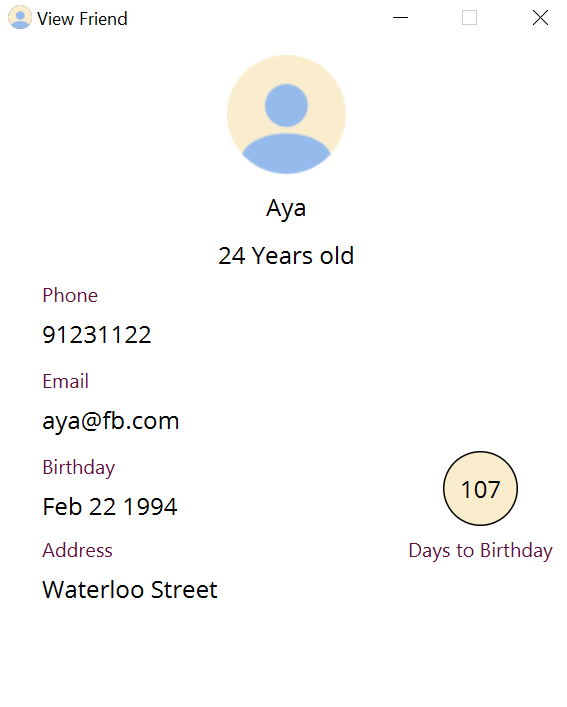
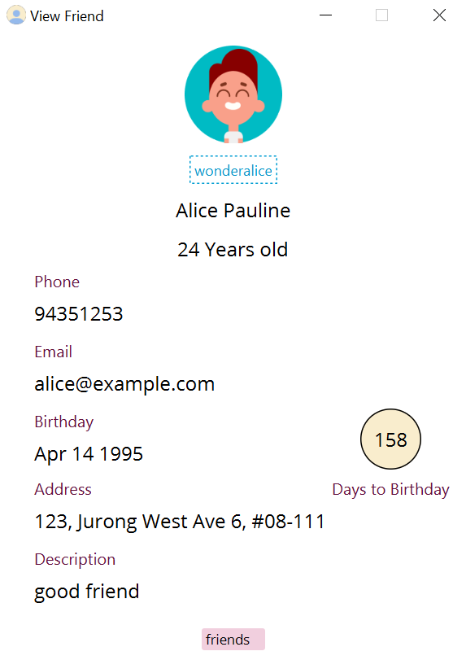
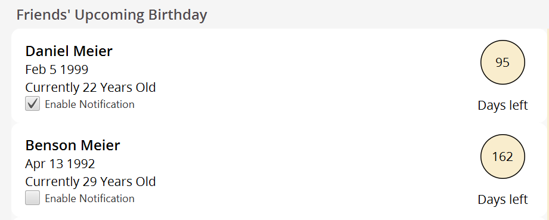
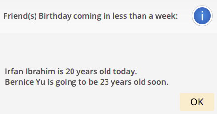
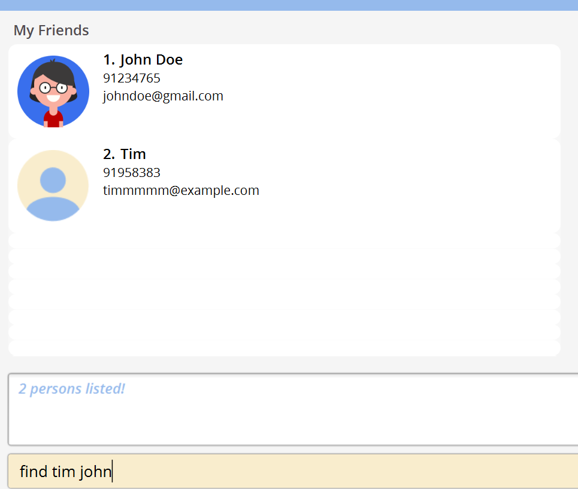
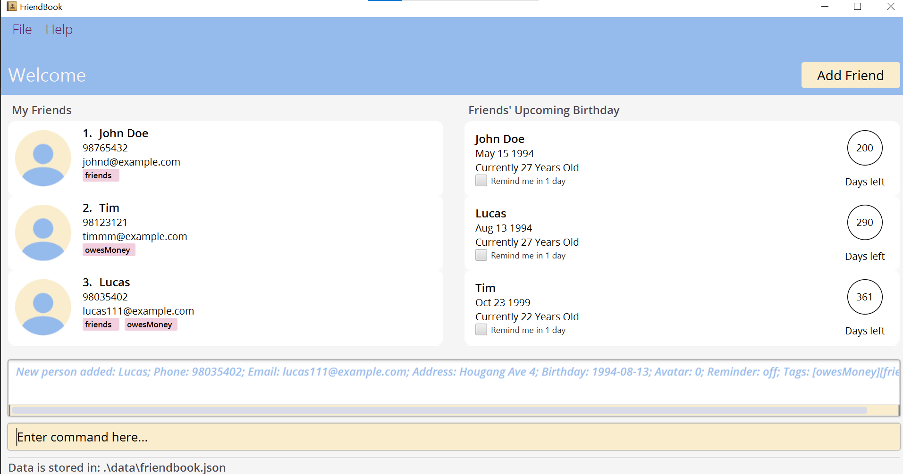

FriendBook is a **desktop app for managing your friends and is optimized for use via a Command Line Interface** (CLI) while still having the benefits of a Graphical User Interface (GUI).
If you can type fast, FriendBook can get your friend management tasks done faster than traditional GUI apps.

FriendBook is mainly targeted for **users with many friends.**

FriendBook addresses the question: **How might we provide users with many ways to manage their friends’ contacts and remember their friends' birthdays?**

_FriendBook provides a contact management platform for users with many friends to track their friends’ contacts. 
Additionally, it also helps users to keep track of social interactions, such as contacting others on Telegram and keeping track of their friends' birthdays to celebrate with them._

* Table of Contents
{:toc}

--------------------------------------------------------------------------------------------------------------------

## Quick Start

1. Ensure you have Java `11` or above installed in your Computer.

2. Download the latest `FriendBook.jar` from [here](https://github.com/AY2122S1-CS2103-F10-3/tp/releases/tag/v1.4).

3. Copy the file to the folder you want to use as the _home folder_ for your FriendBook.

4. Double-click the file to start the app. The GUI similar to the below should appear in a few seconds. Note how the app contains some sample data. 
   

5. Type the command in the command box and press Enter to execute it. e.g. typing **`help`** and pressing Enter will open the help window. 
   Some example commands you can try:

   * **`list`** : Lists all friends.

   * **`add`**`n/John Doe p/98765432 e/johnd@example.com a/John street, block 123, #01-01 b/1994-03-03` : Adds a friend named `John Doe` to the Friend Book.

   * **`delete`**`3` : Deletes the 3rd friend shown in the friend list.

   * **`clear`** : Deletes all friends.

   * **`exit`** : Exits the app.

6. Refer to the [Features](#features) below for details of each command.

--------------------------------------------------------------------------------------------------------------------

## Features

**:information_source: Notes about the command format:** 

* Words in `UPPER_CASE` are the parameters to be supplied by the user. 
  e.g. in `add n/NAME`, `NAME` is a parameter which can be used as `add n/John Doe`.

* Items in square brackets are optional. 
  e.g `n/NAME [t/TAG]` can be used as `n/John Doe t/friend` or as `n/John Doe`.

* Items with `…`​ after them can be used multiple times including zero times. 
  e.g. `[t/TAG]…​` can be used as ` ` (i.e. 0 times), `t/friend`, `t/friend t/family` etc.

* Parameters can be in any order. 
  e.g. if the command specifies `n/NAME p/PHONE_NUMBER`, `p/PHONE_NUMBER n/NAME` is also acceptable.

* If a parameter is expected only once in the command but you specified it multiple times, only the last occurrence of the parameter will be taken. 
  e.g. if you specify `p/12341234 p/56785678`, only `p/56785678` will be taken.

* Extraneous parameters for commands that do not take in parameters (such as `help`, `list`, `exit` and `clear`) will be ignored. 
  e.g. if the command specifies `help 123`, it will be interpreted as `help`.

--------------------------------------------------------------------------------------------------------------------

FriendBook allows for the friends stored to be assigned a custom avatar from 1 of 20 premade avatars for more personality.

To select an avatar, assign the user the avatar based on its number from 1 to 20 e.g `edit 1 avatar/15`

An avatar with the number 0 `edit 1 avatar/0` resets the avatar to its default image.

**Custom Profile**

FriendBook allows users to customise their own profile by adding their own name to the FriendBook. Their name would then be recorded at the top, beside the welcome statement

A user who has set their profile to FriendBookUser.

**Friend Windows**

Users can view the windows of their friends using the `view` command

An example of a profile with only the necessary information added:

An example of a profile with all the fields filled in:

**Reminder Feature**

The reminder feature is a feature designed for users to reminded of their friends' birthdays at an intervals of every 12 hours with a 10 second starting delay on application launch.
The reminder interval resets with any reminder updated for a friend.

The checkbox under each individual friend labelled 'Enable Notification' allows users to select the birthdays of the friends that they wish to be reminded of.

Checking the reminder box sends the user a notification reminding them of that specific friend's birthday within a week or less and notifies every twelve hours before birthday has already past to the following year.

Below is a screenshot of the reminder alert based from the example above.

--------------------------------------------------------------------------------------------------------------------

## Constraints

**:information_source: Summary of the various constraints for each field:** 

The various fields in a contact have differing constraints from one another. Below are the contraints to ensure valid fields are entered correctly. Fields which are not mentioned have no restrictions on input.

**Name (Compulsory)**
   * Names can only contain alphanumeric characters/spaces/hyphens/underscores. 
   
   * Names are not allowed to start with numbers e.g `123 John`. 
   
   * Names cannot consist solely of numbers. 
   
   * Hyphens/Underscores present MUST be preced by a character. 
   
   * Consecutive hyphens/underscores are not allowed. 
   
   * Names are not allowed to begin with spaces. 
   
**Phone (Compulsory)**
   * Only consists of numbers, and at least 3 digits long. 
   
   * No two people can have the same phone numbers. 
   
   
**Email (Compulsory)**
   * Emails should be of the format `local-part@domain`. 
  
      * The local-part should only contain alphanumeric characters and any of these special characters: `+`, `_`, `.`, `-`
      
      * The local-part should not start or end with any of the above special characters
      
      * The domain name must:
   
         * end with a domain label at least 2 characters long e.g  `com`, `net`
         
         * have each domain label start and end with an alphanumeric character.
         
         * have each domain label separated by periods.
   
         * have each domain label consist of alphanumeric characters, separated by hyphens (if any).
   
   * No two people can have the same email. 
   
**Birthday (Compulsory)**
   * Only `YYYY-MM-DD` format is allowed
   
**Avatar**
   * Only avatar numbers from 0 to 20 are allowed
      
**TeleHandle**
   * Handles are case-insensitive, can contain underscores and digits
   
   * Handles must be at least 5 characters long
   
   * `@` domain is not required in the input. 
      
**Reminder**
   * Only 2 valid inputs - `on` and `off`. Both are case-insensitive

### Adding a Friend: `add`

Adds a friend to the FriendBook.

Format: `add n/NAME p/PHONE_NUMBER e/EMAIL b/BIRTHDAY [a/ADDRESS] [avatar/AVATAR] [tele/TELEHANDLE] [desc/DESCRIPTION] [r/REMINDER] [t/TAG]…​`

* Friends can have the same name, but must have different phone numbers, emails and addresses

* A friend can have any number of tags (including 0)
   
* The avatar value must only be from 0 to 20
   
* The only valid reminder inputs are 'on' and 'off'

Examples:
* `add n/John Doe p/98765432 e/johnd@example.com a/John street, block 123, #01-01 b/1985-05-13`
* `add n/Betsy Crowe t/friend e/betsycrowe@example.com a/Newgate Prison p/1234567 b/1999-10-22 t/criminal`
* `add n/James Low p/91593836 e/jameslow@example.com a/Hougang Avnue 5 b/1980-04-01 avatar/5 tele/jameslow222 desc/doctor r/on t/friends`

### List all friends : `list`

Shows a list of all friends in the FriendBook.

Format: `list`

### Editing a friend : `edit`

Edits an existing friend in the FriendBook.

Format: `edit INDEX [n/NAME] [p/PHONE_NUMBER] [e/EMAIL] [a/ADDRESS] [b/BIRTHDAY] [avatar/AVATAR] [tele/TELE HANDLE] [desc/DESCRIPTION] [r/REMINDER] [t/TAG]…​[t/TAG]…`

* Edits the friend at the specified `INDEX`. The index refers to the index number shown in the CURRENTLY displayed friend list. The index **must be a positive integer** 1, 2, 3, …​
* At least one of the optional fields must be provided.
* Existing values will be updated to the input values.
* When editing tags, the existing tags of the person will be removed i.e adding of tags is not cumulative.
* You can remove all the person’s tags by typing `t/` without specifying any tags after it.
* Leaving any fields blank e.g `tele/` clears that field

Examples:
*  `edit 1 p/91234567 e/johndoe@example.com` Edits the phone number and email address of the 1st person to be `91234567` and `johndoe@example.com` respectively.
*  `edit 2 n/Betsy Crower t/` Edits the name of the 2nd friend in the current list to be `Betsy Crower` and clears all existing tags.
*  `edit 2 avatar/6 tele/ desc/` Edits the avatar of the 2nd friend to be the 6th default avatar, and clears their telegram handle and description
*  `edit 4 b/1992-01-10 avatar/10 tele/newTelehandle desc/xyz` Edits the 4th friend in the list and updates his/her birthday to `1992-01-10`, avatar to `10`, telegram handle to `newTelehandle` and description to `xyz`

### Locating friend by name: `find`

Finds friends whose names contain any of the given keywords.

Format: `find KEYWORD [MORE_KEYWORDS]`

* The keywords are names of friends stored in FriendBook
* The search is case-insensitive. e.g `hans` will match `Hans`
* The order of the keywords does not matter. e.g. `Hans Bo` will match `Bo Hans`
* Only the name is searched
* Only full words will be matched e.g. `Han` will not match `Hans`
* Persons matching at least one keyword will be returned (i.e. `OR` search).
  e.g. `Hans Bo` will return `Hans Gruber`, `Bo Yang`

Examples:
* `find John` returns `John Doe`
* `find tim john` returns `Tim`, `John Doe` 
  

### Locating friends by tag: `findtag`

Finds friends whose tags contain any of the given keywords.

Format: `find KEYWORD [MORE_KEYWORDS]`

* The search is case-insensitive. e.g `owesmoney` will match `owesMoney`
* The order of the keywords does not matter. e.g. `friends owesMoney` will match `owesMoney friends`
* Only the tags are searched.
* Only full words will be matched e.g. `friend` will not match `friends`
* friends matching at least one keyword will be returned (i.e. `OR` search).
  e.g. `friends owesMoney` will return all friends with `friends` and `owesMoney` in their tags

Examples:

Using the given FriendBook below, when using the `findtag` command:
* `findtag friends` returns `John Doe` and `Lucas`
* `findtag owesMoney` returns `Tim` and `Lucas` 
  

### Viewing a contact: `view`

View the full contact details (address, email, description etc) of the friend stored in FriendBook.

Format: `view INDEX`

* Views the friend at the specified `INDEX`.
* The index refers to the index number shown in the currently displayed friend list.
* The index **must be a positive integer** 1, 2, 3, …​

Examples:
* Inputting the `list` command followed by the `view 1` command views the full details of the 1st friend in the FriendBook.  
  

### Deleting a person : `delete`

Deletes the specified friend from the FriendBook.

Format: `delete INDEX`

* Deletes the friend at the specified `INDEX`.
* The index refers to the index number shown in the displayed person list.
* The index **must be a positive integer** 1, 2, 3, …​

Examples:
* `list` followed by `delete 2` deletes the 2nd friend in the FriendBook.
* `find Betsy` followed by `delete 1` deletes the 1st friend in the results of the `find` command.

### Adding your profile: `profile`

Adds the user profile to the FriendBook

Format: `profile n/NAME`

Examples:
* `profile n/John sets the user profile name to John`

### Viewing help : `help`

Shows a message explaining the basics of each command, and a link to the full user guide.

Format: `help`

### Clearing all entries : `clear`

Clears all entries from the FriendBook.

Format: `clear`

### Exiting the program : `exit`

Exits the program.

Format: `exit`

### Saving the data

FriendBook data are saved in the hard disk automatically after any command that changes the data. There is no need to save manually.

### Editing the data file

FriendBook data are saved as a JSON file `[JAR file location]/data/friendbook.json`. Advanced users are welcome to update data directly by editing that data file, subjected to the following [field constraints](#constraints)

:exclamation: **Caution:**
If your changes to the data file makes its format invalid i.e having extra/missing parameters or the edited field violates any of the above constraints, FriendBook will discard all data and start with an empty data file at the next run.

--------------------------------------------------------------------------------------------------------------------

## FAQ

**Q**: How do I transfer my data to another Computer? 
**A**: Install the app in the other computer and overwrite the empty data file it creates with the file that contains the data of your previous FriendBook home folder.

**Q**: How can I refer for help without the user guide? 
**A**: Inside FriendBook, we have a help window to display all commands FriendBook offers. It can be accessed by typing: `help`.

**Q**: Where is the data stored? 
**A**: In the footer of the FriendBook, it displays where the data is stored.

--------------------------------------------------------------------------------------------------------------------

## Command summary

Items in square brackets are optional. 

Action | Format | Examples
--------|------------|------
**Add** | `add n/NAME p/PHONE_NUMBER e/EMAIL b/BIRTHDAY [a/ADDRESS] [avatar/AVATAR] [tele/TELEHANDLE] [desc/DESCRIPTION] [r/REMINDER] [t/TAG]…​` | `add n/James Ho p/22224444 e/jamesho@example.com b/1994-02-15 a/123, Clementi Rd, 1234665 avatar/5 tele/jamesho123 desc/cool friend r/off t/friend t/colleague`
**Clear** | `clear` | `clear`
**Delete** | `delete INDEX` | `delete 3`
**Edit** | `edit INDEX [n/NAME] [p/PHONE_NUMBER] [e/EMAIL] [a/ADDRESS] [b/BIRTHDAY] [avatar/AVATAR] [tele/TELEHANDLE] [desc/DESCRIPTION] [r/REMINDER] [t/TAG]…​` | `edit 2 n/James Lee e/jameslee@example.com desc/changed description`
**Find** | `find KEYWORD [MORE_KEYWORDS]`| `find James Jake`
**Findtag** | `findtag KEYWORD [MORE_KEYWORDS]` | `findTag friends owesMoney`
**List** | `list` | `list`
**Profile** | `profile n/NAME` | `profile n/James Ho`
**View** | `view INDEX` | `view 2`
**Help** | `help` | `help`

