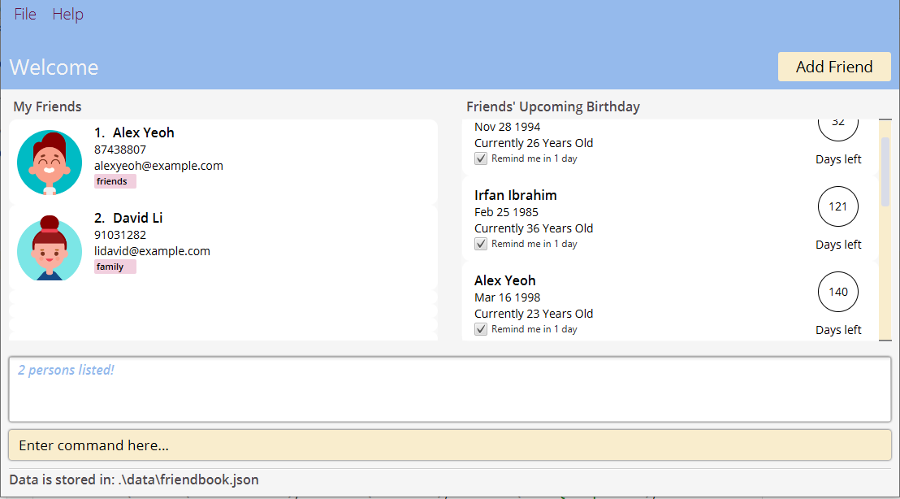

FriendBook is a **desktop app for managing your friends and is optimized for use via a Command Line Interface** (CLI) while still having the benefits of a Graphical User Interface (GUI).
If you can type fast, FriendBook can get your friend management tasks done faster then traditional GUI apps.

Targeted user profile: University students

Problem addressed: How might we provide university students to manage their friends’ contacts?

Value proposition: Friend Book is not just a contact management platform for university students to track their friends’ contact. It also helps to keep track of social interactions with their friends.
Main Dashboard

* Table of Contents
{:toc}

--------------------------------------------------------------------------------------------------------------------

## TO UPDATE: Quick Start

1. Ensure you have Java `11` or above installed in your Computer.

1. TO CHANGE:  Download the latest `friendbook.jar` from [here](https://github.com/se-edu/addressbook-level3/releases).

1. Copy the file to the folder you want to use as the _home folder_ for your FriendBook.

1. TO UPDATE: Double-click the file to start the app. The GUI similar to the below should appear in a few seconds. Note how the app contains some sample data. 
   

1. Type the command in the command box and press Enter to execute it. e.g. typing **`help`** and pressing Enter will open the help window. 
   Some example commands you can try:

  * **`list`** : Lists all contacts.

  * **`TO UPDATE: add`**`n/John Doe p/98765432 e/johnd@example.com a/John street, block 123, #01-01` : Adds a contact named `John Doe` to the FriendBook.

  * **`delete`**`3` : Deletes the 3rd friend shown in the friend list.

  * **`clear`** : Deletes all contacts.

  * **`exit`** : Exits the app.

1. Refer to the [Features](#features) below for details of each command.

--------------------------------------------------------------------------------------------------------------------

## Features

**:information_source: Notes about the command format:** 

* Words in `UPPER_CASE` are the parameters to be supplied by the user. 
  e.g. in `add n/NAME`, `NAME` is a parameter which can be used as `add n/John Doe`.

* Items in square brackets are optional. 
  e.g `n/NAME [t/TAG]` can be used as `n/John Doe t/friend` or as `n/John Doe`.

* Items with `…`​ after them can be used multiple times including zero times. 
  e.g. `[t/TAG]…​` can be used as ` ` (i.e. 0 times), `t/friend`, `t/friend t/family` etc.

* Parameters can be in any order. 
  e.g. if the command specifies `n/NAME p/PHONE_NUMBER`, `p/PHONE_NUMBER n/NAME` is also acceptable.

* If a parameter is expected only once in the command but you specified it multiple times, only the last occurrence of the parameter will be taken. 
  e.g. if you specify `p/12341234 p/56785678`, only `p/56785678` will be taken.

* Extraneous parameters for commands that do not take in parameters (such as `help`, `list`, `exit` and `clear`) will be ignored. 
  e.g. if the command specifies `help 123`, it will be interpreted as `help`.

### Viewing help : `help`

Shows a message explaning how to access the help page.

Format: `help`

### Adding a person: `add`

Adds a person to the FriendBook.

Format: `add n/NAME p/PHONE_NUMBER e/EMAIL a/ADDRESS [t/TAG]…​`

:bulb: **Tip:**
A person can have any number of tags (including 0)

Examples:
* `add n/John Doe p/98765432 e/johnd@example.com a/John street, block 123, #01-01`
* `add n/Betsy Crowe t/friend e/betsycrowe@example.com a/Newgate Prison p/1234567 t/criminal`

### Listing all persons : `list`

Shows a list of all persons in the FriendBook.

Format: `list`

### Editing a person : `edit`

Edits an existing person in the AddressBook.

Format: `edit INDEX [n/NAME] [p/PHONE] [e/EMAIL] [a/ADDRESS] [t/TAG]…​`

* Edits the person at the specified `INDEX`. The index refers to the index number shown in the displayed person list. The index **must be a positive integer** 1, 2, 3, …​
* At least one of the optional fields must be provided.
* Existing values will be updated to the input values.
* When editing tags, the existing tags of the person will be removed i.e adding of tags is not cumulative.
* You can remove all the person’s tags by typing `t/` without
  specifying any tags after it.

Examples:
*  `edit 1 p/91234567 e/johndoe@example.com` Edits the phone number and email address of the 1st person to be `91234567` and `johndoe@example.com` respectively.
*  `edit 2 n/Betsy Crower t/` Edits the name of the 2nd person to be `Betsy Crower` and clears all existing tags.

### Locating persons by name: `find`

Finds persons whose names contain any of the given keywords.

Format: `find KEYWORD [MORE_KEYWORDS]`

* The search is case-insensitive. e.g `hans` will match `Hans`
* The order of the keywords does not matter. e.g. `Hans Bo` will match `Bo Hans`
* Only the name is searched.
* Only full words will be matched e.g. `Han` will not match `Hans`
* Persons matching at least one keyword will be returned (i.e. `OR` search).
  e.g. `Hans Bo` will return `Hans Gruber`, `Bo Yang`

Examples:
* `find John` returns `john` and `John Doe`
* `find alex david` returns `Alex Yeoh`, `David Li` 
  

### Viewing a contact: `view`

View the full contact details (address, email, description etc) of the person stored in FriendBook

Format: `view INDEX`

* Views the person at the specified `INDEX`.
* The index refers to the index number shown in the currently displayed person list.
* The index **must be a positive integer** 1, 2, 3, …​

Examples:
* `list` followed by `view 1` views the full details of the 1st person in the FriendBook.

### Deleting a person : `delete`

Deletes the specified person from the FriendBook.

Format: `delete INDEX`

* Deletes the person at the specified `INDEX`.
* The index refers to the index number shown in the displayed person list.
* The index **must be a positive integer** 1, 2, 3, …​

Examples:
* `list` followed by `delete 2` deletes the 2nd person in the FriendBook.
* `find Betsy` followed by `delete 1` deletes the 1st person in the results of the `find` command.

### Clearing all entries : `clear`

Clears all entries from the FriendBook.

Format: `clear`

### Exiting the program : `exit`

Exits the program.

Format: `exit`

### Saving the data

FriendBook data are saved in the hard disk automatically after any command that changes the data. There is no need to save manually.

### Editing the data file

FriendBook data are saved as a JSON file `[JAR file location]/data/friendbook.json`. Advanced users are welcome to update data directly by editing that data file.

:exclamation: **Caution:**
If your changes to the data file makes its format invalid, FriendBook will discard all data and start with an empty data file at the next run.

### Archiving data files `[coming in v2.0]`

_Details coming soon ..._

--------------------------------------------------------------------------------------------------------------------

## TO UPDATE: FAQ

**Q**: How do I transfer my data to another Computer? 
**A**: Install the app in the other computer and overwrite the empty data file it creates with the file that contains the data of your previous FriendBook home folder.

--------------------------------------------------------------------------------------------------------------------

## TO UPDATE: Command summary

Action | Format, Examples
--------|------------------
**Add** | `add n/NAME p/PHONE_NUMBER e/EMAIL a/ADDRESS [t/TAG]…​`   e.g., `add n/James Ho p/22224444 e/jamesho@example.com a/123, Clementi Rd, 1234665 t/friend t/colleague`
**Clear** | `clear`
**Delete** | `delete INDEX`  e.g., `delete 3`
**Edit** | `edit INDEX [n/NAME] [p/PHONE_NUMBER] [e/EMAIL] [a/ADDRESS] [t/TAG]…​`  e.g.,`edit 2 n/James Lee e/jameslee@example.com`
**Find** | `find KEYWORD [MORE_KEYWORDS]`  e.g., `find James Jake`
**List** | `list`
**Help** | `help`

=====

OLD VERSION BELOW:
TO DELETE ONCE UG IS DONE

### CS2103-F10-3 User Guide for v1.2
#### Friend Book

Command Pop up

#### Features
- Tagging - group contacts together
- Contacts
- Birthdays

#### Contacts
##### Adding a contact: add
--- Adds a person to the FriendBook.
Format: `add [n/NAME] [p/PHONE_NUMBER] [e/EMAIL] [a/ADDRESS] [t/TAG] [tele/TELE_USERNAME] [b/BIRTHDAY(dd/mm)]...`

 :bulb: Tip: A person can have any number of tags (including 0)
 :bulb: Tip: The telegram username, and the birthday fields are optional. The birthday field has to be specified in    dd/mm format.
- When adding contacts to the friend book, the user can specify any number of tags he/she chooses to be tagged to the individual (see examples 1 and 2 below)

##### Examples:
- `add n/James Lim e/jl123@gmail.com p/94617232 /a Bugis Street 1234` adds an individual with zero tags
- `add n/James Lim e/jl123@gmail.com p/94617232 /a Bugis Street 1234 t/friend t/NUS` adds an individual with a ‘Friend” and ‘NUS’ tag
- `add n/John Doe p/98765432 e/johnd@example.com a/John street, block 123, #01-01`
- `add n/Betsy Crowe t/friend e/betsycrowe@example.com a/Newgate Prison p/1234567 t/criminal tele/@CroweBetsss b/03/12`

##### Listing all contacts : list
Shows a list of all contacts in the Friend book.
Format: list

##### Editing a contact : edit
Edits an existing contact in the FriendBook.
Format: `edit INDEX [n/NAME] [p/PHONE_NUMBER] [e/EMAIL] [a/ADDRESS] [t/TAG] [tele/TELE_USERNAME] [b/BIRTHDAY(dd/mm)]...`

- Edits the person at the specified INDEX. The index refers to the index number shown in the displayed person list. The index must be a positive integer 1, 2, 3, …​
- At least one of the optional fields must be provided.
- Existing values will be updated to the input values.
- When updating an existing contact’s tag, the user has to input all existing tags AND the new tag(s) to be added (see example 3 below)
- You can remove all the person’s tags by typing t/ without specifying any tags after it (see example 4)
- When editing the telegram username the old value is replaced by the new value, if one is provided. The telegram username for a contact can be removed by typing just tele/ without specifying any tele username.

##### Examples:
1. `edit 1 p/91234567 e/johndoe@example.com`
This edits the phone number and email address of the 1st person to be 91234567 and johndoe@example.com respectively.
2. `edit 2 n/Betsy Crower t/ tele/`
Edits the name of the 2nd person to be Betsy Crower, clears all existing tags, and removes the associated telegram username.
3. `edit 1 t/friend t/NUS t/basketball`
adds a ‘basketball’ tag to an individual with an existing ‘friend’ and ‘NUS’ tag
4. `edit 1 t/`
removes all tags associated with the individual at index ‘1’

##### Searching by keyword: find
Finds contacts whose **names, email, address, tags or telegram username** contain any of the given keywords.
Format: `find [n/NAME] [p/PHONE_NUMBER] [e/EMAIL] [a/ADDRESS] [t/TAG] [tele/TELE_USERNAME] [b/BIRTHDAY(dd/mm)]...`
- At least one search field must be specified
- Every search field can have multiple keywords e.g. find n/Hans Bo
- The search is case-insensitive. e.g hans will match Hans
- The order of the keywords does not matter. e.g. Hans Bo will match Bo Hans
- Only full words will be matched e.g. @Crowe doesn’t match @CroweBetsss
- As long as a contact has even one keyword in a given field, the field is considered a match. e.g. Hans Bo matches Hans Gruber, Bo Yang; John matches both John and John Doe
- Only the contacts that match all the specified fields are returned
##### Examples:
1. `find n/John tele/@JohnDoe`
Returns John Doe who has a telegram username of @JohnDoe. However a contact with the name Johnathan will not be returned since John does not match Johnathan; also a contact with the name John and telegram username of @Johnny will not be returned since @JohnDoe does not match @Johnny

##### Deleting a contact : delete
Deletes the specified contact from the friend book.
Format: `delete INDEX`
- Deletes the contact at the specified INDEX.
- The index refers to the index number shown in the displayed contact list.
- The index **must be a positive integer** 1, 2, 3, …​

##### Examples:
1. `delete 2` deletes the 2nd contact in the contact book.
2. `find Betsy` followed by `delete 1` deletes the 1st contact in the results of the `find` command.

##### Tagging
An accordian list of tags

Allows the user to attach a tag(s) to an individual in the friend book.

- When adding contacts to the friend book, the user can specify any number of tags he/she chooses to be tagged to the individual (see examples 1 and 2 below)
- When updating an existing contact’s tag, the user has to input all existing tags AND the new tag(s) to be added (see example 3 below)
- To clear all tags attached to the individual, perform an update on the individual, without specifying any tags in the tag field (see example 4 below).

Examples:

1. `add n/James Lim e/jl123@gmail.com p/94617232 /a Bugis Street 1234` adds an individual with zero tags
2. `add n/James Lim e/jl123@gmail.com p/94617232 /a Bugis Street 1234 t/friend t/NUS` adds an individual with a ‘Friend” and ‘NUS’ tag
3. `edit 1 t/friend t/NUS t/basketball` adds a ‘basketball’ tag to an individual with an existing ‘friend’ and ‘NUS’ tag
4. `edit 1 t/` removes all tags associated with the individual at index ‘1’

#### Birthdays
Table view of all friend’s birthdays with a checkbox to set reminders

Each contact registered can have a birthday date registered to them as well, and this birthday date can be used with different commands to receive an output

If the birthday is set to be reminded, a reminder will be sent when the application is opened;

The following commands can be adapted to use with the birthday functionality:

- ##### List
    Returns a list of all the friends registered and sorted based on their birthday
    Format: `list [b/BIRTHDAY]`

- ##### Find
    Returns a list of friends who have a birthday on the specified month
    Format: `find [b/BIRTHDAY] KEYWORD`
The `KEYWORD`  input must be a month of the year
The `KEYWORD`  is case-insensitive (e.g January will match january)
Examples:
`find January` returns the list of all contacts who have January as their birthday month

- ##### Edit
    Edit a friend’s birthday edit `[n/NAME][b/BIRTHDAY] `
Format: edit `[n/NAME][b/BIRTHDAY]`

- ##### Remind
    Returns a list of friends who have a birthday from the current date to up to seven days from the current date `remind [b/BIRTHDAY]`
Format: `remind [b/BIRTHDAY]`
