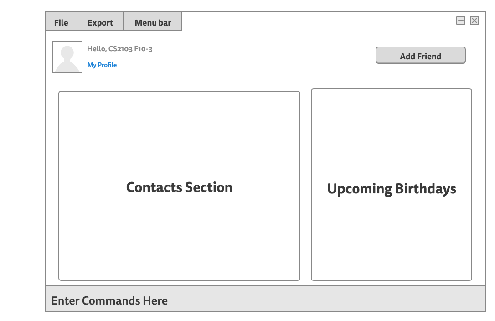

**FriendBook provides a contact management platform for users with many friends to track their friends’ contacts. Additionally, it also helps users to keep track of social interactions with their friends and their friends’ birthdays.** While it has a GUI, most of the user interactions happen using a CLI (Command Line Interface).

* If you are interested in using FriendBook, head over to the [_Quick Start_ section of the **User Guide**](UserGuide.html#quick-start).
* If you are interested about developing FriendBook, the [**Developer Guide**](DeveloperGuide.html) is a good place to start.
* If you would like to see a demo video of our recent release (**v1.4**) as well, click [**here**](https://drive.google.com/file/d/1Mi7vEL6htqStxipfGBbUHKzwggzFgfZ2/view?usp=sharing) to see.

**Acknowledgements**

* Libraries used: [JavaFX](https://openjfx.io/), [Jackson](https://github.com/FasterXML/jackson), [JUnit5](https://github.com/junit-team/junit5)
* Avatar logos from Figma [here](https://www.figma.com/community/file/898457975261805002).
